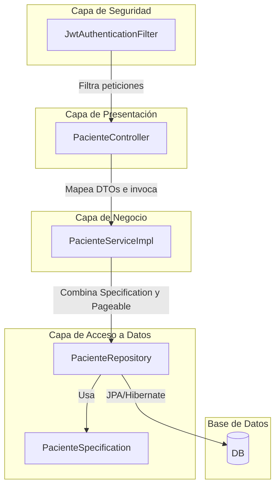
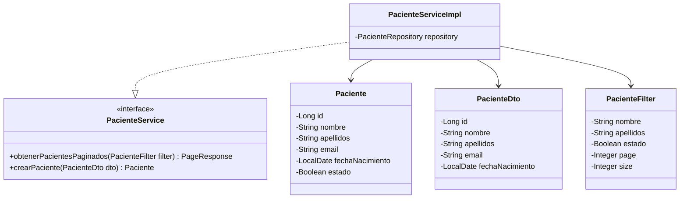
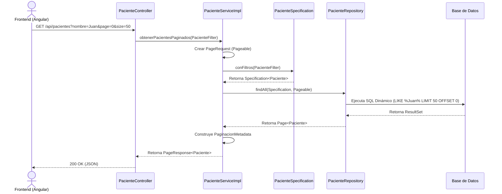

# Backend API - Gestión de Pacientes

API RESTful desarrollada en Java y Spring Boot que provee los servicios necesarios para la gestión y persistencia de la información de los pacientes. 

## Stack Tecnológico

- Java 17+
- Spring Boot 3.x (Web, Data JPA, Security)
- Lombok (Reducción de código repetitivo)
- PostgreSQL / MySQL (Base de datos relacional)
- Maven (Gestor de dependencias)
- Docker (Contenerización)

## Diagrama de Componentes

Muestra cómo están estructurados los paquetes lógicos dentro del backend.



## Diagrama de Clases (Dominio principal)

Estructura de las entidades, DTOs y Servicios principales relacionados con el Paciente.



## Diagrama de Secuencia: Listado con Filtros y Paginación

Muestra el flujo de ejecución cuando el cliente solicita la tabla de pacientes.



## Cómo ejecutar el proyecto (Docker)

El proyecto incluye un Dockerfile multietapa y configuración para levantar todo el entorno mediante Maven y Docker.

1. Asegúrate de estar en el directorio /backend.
2. Compilar y empaquetar el proyecto (evitando tests para despliegue rápido):
   ```bash
   mvn clean package -DskipTests
   ```
3. Construir la imagen de Docker:
   ```bash
   docker build backend --no-cache.
   ```
4. Levantar el contenedor (o usar docker-compose si está disponible):
   ```bash
   docker up backend -d
   ```