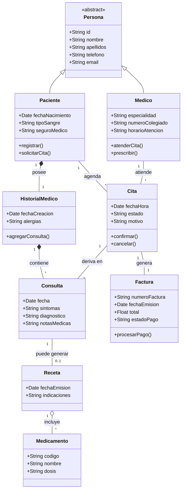

# Diagrama de Clases - Sistema de Clínica Médica

A continuación se presenta el diagrama de clases para la estructura del sistema de gestión de una clínica:

```mermaid
classDiagram
    class Persona {
        <<abstract>>
        +String id
        +String nombre
        +String apellidos
        +String telefono
        +String email
    }

    class Paciente {
        +Date fechaNacimiento
        +String tipoSangre
        +String seguroMedico
        +registrar()
        +solicitarCita()
    }

    class Medico {
        +String especialidad
        +String numeroColegiado
        +String horarioAtencion
        +atenderCita()
        +prescribir()
    }

    class Cita {
        +Date fechaHora
        +String estado
        +String motivo
        +confirmar()
        +cancelar()
    }

    class HistorialMedico {
        +Date fechaCreacion
        +String alergias
        +agregarConsulta()
    }

    class Consulta {
        +Date fecha
        +String sintomas
        +String diagnostico
        +String notasMedicas
    }

    class Receta {
        +Date fechaEmision
        +String indicaciones
    }

    class Medicamento {
        +String codigo
        +String nombre
        +String dosis
    }

    class Factura {
        +String numeroFactura
        +Date fechaEmision
        +Float total
        +String estadoPago
        +procesarPago()
    }

    %% Relaciones de Herencia
    Persona <|-- Paciente
    Persona <|-- Medico

    %% Relaciones de Asociación
    Paciente "1" -- "*" Cita : agenda
    Medico "1" -- "*" Cita : atiende
    
    %% Relaciones de Composición (Dependencia fuerte)
    Paciente "1" *-- "1" HistorialMedico : posee
    HistorialMedico "1" *-- "*" Consulta : contiene
    Cita "1" -- "1" Consulta : deriva en
    
    %% Relaciones de Agregación (Dependencia débil)
    Consulta "1" -- "0..1" Receta : puede generar
    Receta "1" o-- "*" Medicamento : incluye
    
    %% Facturación
    Cita "1" -- "1" Factura : genera
```